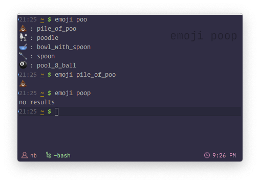

# @nberlette/emoji

Terribly simple emoji-finder command line script.

## Installation

<table cellpadding=0 cellspacing=0 width="100%">
<tbody><tr>
<td width="50%">

### Yarn (recommended)
```bash
yarn global add @nberlette/emoji
```

</td>
<td width="50%">

### ... or with npm
```bash
npm install -g @nberlette/emoji
```

</td>
</tr></tbody>
</table>

## Usage

```bash
emoji [keyword]
```

* **Exact hit**: returns just the emoji for `keyword`
* **Single result**:same as above, even if `keyword` isn't a direct match
* **Multiple results**: returns array of emojis and keywords that contain `keyword`
* If `keyword` is omitted, returns the whole emoji list

